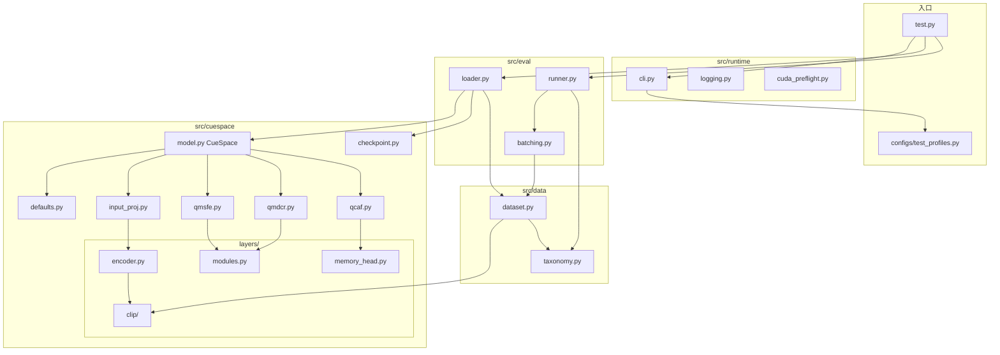
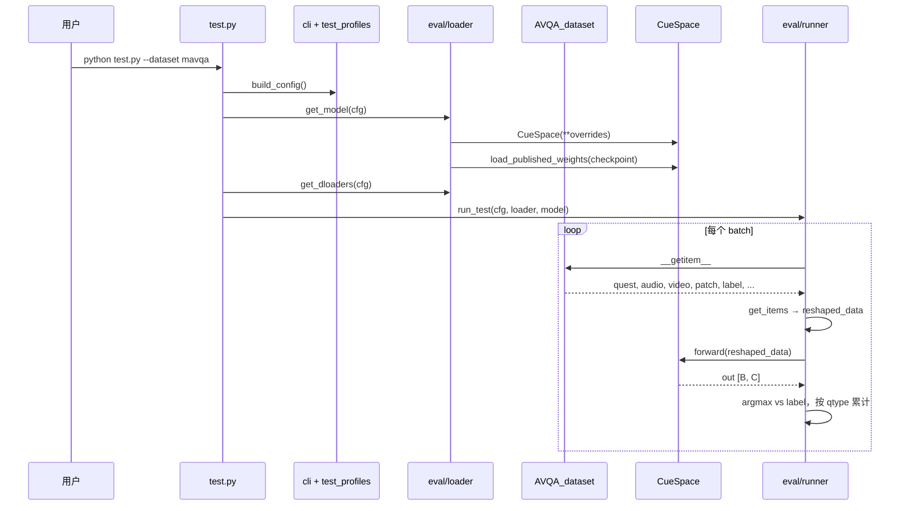
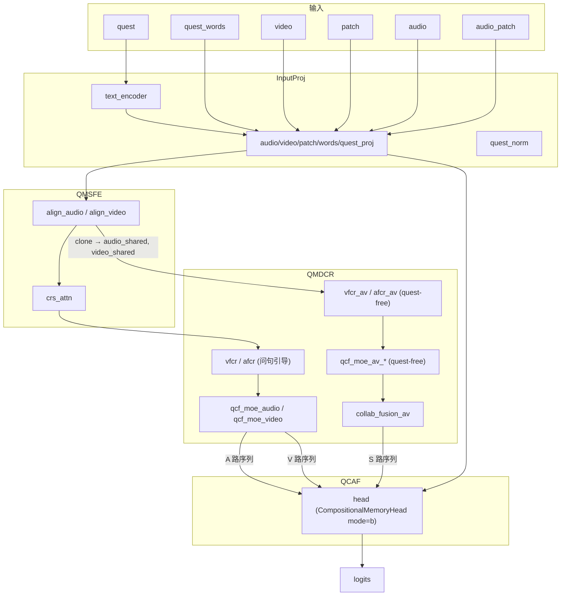
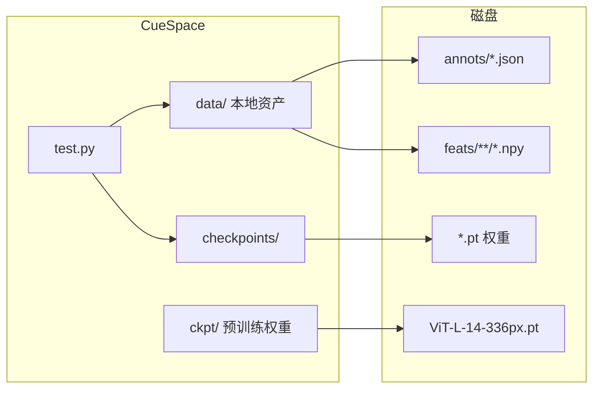

# CueSpace 架构说明

本文档描述 **CueSpace 纯测试版**仓库的代码结构、模块依赖、运行时数据流，以及实现与论文方法（QMSFE / QMDCR / QCAF）的对应关系。面向阅读源码与复现 benchmark，不涉及训练期历史实验分支。

---

## 1. 设计目标

CueSpace 发布版只做 **推理与评测**。模型前向路径固定为：

```
多级离线特征 + CLIP 问句编码
        ↓
InputProj（投影 + 文本编码）
        ↓
QMSFE（模态对齐 + 问句引导跨模态增强）
        ↓
QMDCR（FCR → QCF-MoE → 协作 cue S）
        ↓
QCAF（组合记忆 readout）
        ↓
logits
```

已删除：PLE 栈、v32 三头、qprompt、evidence aux 推理路径、九塔 task-specific 路由等训练实验代码。公布权重通过 `checkpoint.py` 前缀 remap 加载到新模块名。

---

## 2. 仓库分层

```
┌──────────────────────────────────────────────────────────────────┐
│  入口          test.py                                            │
│  配置          configs/test_profiles.py                           │
├──────────────────────────────────────────────────────────────────┤
│  运行时        src/runtime/   cli · logging · cuda_preflight      │
├──────────────────────────────────────────────────────────────────┤
│  评测          src/eval/      loader · runner · batching          │
├──────────────────────────────────────────────────────────────────┤
│  数据          src/data/      dataset · taxonomy                  │
├──────────────────────────────────────────────────────────────────┤
│  模型          src/cuespace/  model · input_proj · qmsfe ·        │
│                               qmdcr · qcaf · checkpoint · layers  │
└──────────────────────────────────────────────────────────────────┘
         │                                    │
         ▼                                    ▼
  data/ · ckpt/ · checkpoints/          scripts/extract_features.sh
  （本地 data/ 软链或拷贝）              （离线特征，非 test 必需）
```

| 层级 | 职责 | 关键文件 |
|------|------|----------|
| 入口 | CLI 解析、启动评测 | `test.py` |
| 配置 | benchmark 路径、权重、batch 等 | `configs/test_profiles.py` |
| 运行时 | 日志、GPU 预检、随机种子 | `src/runtime/cli.py` 等 |
| 评测 | 建模型、DataLoader、精度统计 | `src/eval/loader.py`, `runner.py` |
| 数据 | 读标注与 npy 特征、题型映射 | `src/data/dataset.py`, `taxonomy.py` |
| 模型 | 论文对齐的前向栈 | `src/cuespace/*.py` |

**依赖规则（无环）：** `runtime` → 不依赖 `eval`/`data`/`cuespace`；`eval` → 可依赖 `runtime`、`data`、`cuespace`；`data` → 仅用 `layers.clip` 做 tokenize；`cuespace` → 不依赖 `eval`/`dataset`。

---

## 3. 模块依赖图



---

## 4. 运行时数据流



### 4.1 Batch 字段（Dataset → Batching → Model）

| 字段 | 形状 / 来源 | 作用 |
|------|-------------|------|
| `video` | `[B,T,D_v]` 离线 npy | 视觉帧级流 **F_v** |
| `patch` | `[B,T,P,D_p]` | 视觉 patch **P_v**（VFCR 输入） |
| `audio` | `[B,T,D_a]` | 音频帧级流 **F_a** |
| `audio_patch` | `[B,T,P,D_ap]` | 音频 patch **P_a**（AFCR 输入） |
| `quest` | token id 或预提取向量 | 句级问句 **Q_s** |
| `quest_words` | 可选，离线词级特征 | 词级问句 **Q_w** |
| `cand_quest` | MCQ：`[B,4,seq]` | 四选项文本 |
| `cand_words` | MCQ 词级（可选） | per_option_full 用 |
| `qtype_label` | `[B]` | Question-type routing (QCFMoE / FCR) |
| `label` | `[B]` 或 `[B,1]` | 评测标签 |
| `answer_mode` | 字符串 | `open_vocab` / `mcq` |
| `mcq_forward_mode` | 字符串 | `shared_stacked` / `per_option_full` |

`get_items`（`eval/batching.py`）负责 dtype、device、维度整理，输出 `reshaped_data` 字典供 `CueSpace.forward` 消费。

---

## 5. 模型前向（论文 ↔ 代码）

### 5.1 总览



`CueSpace`（`model.py`，~130 行）仅做编排：`input_proj` → `qmsfe.enhance` → `qmdcr` → `qcaf`。

### 5.2 InputProj

| 属性 | 实现 | 旧 checkpoint 前缀 |
|------|------|-------------------|
| CLIP 文本编码 | `text_encoder` | `quest_encoder` |
| 模态投影 | `audio_proj`, `video_proj`, `patch_proj`, `audio_patch_proj` | 同名 |
| 问句 / 词投影 | `quest_proj`, `words_proj`, `quest_norm` | 同名 |

- `encode_text`：在线 CLIP token → 句向量 + 词序列；或直接使用离线 float 特征。
- `project_modalities`：将五级输入投影到 `d_model=512`。
- `project_candidate_quests`：MCQ `shared_stacked` 模式下编码四选项。

### 5.3 QMSFE

| 属性 | 算子 | 旧前缀 |
|------|------|--------|
| Modality LN+Linear | `qmsfe.align_audio`, `qmsfe.align_video` | `ot_align_audio`, `ot_align_video` |
| 问句引导增强 | `crs_attn` | `crs_attn` |

**关键语义：** `enhance()` 先对齐，再 **clone** 得到 `audio_shared` / `video_shared`（对齐后、crs_attn 前），然后对主路 A/V 做 crs_attn。协作支路 S 使用 shared 副本，主路 A/V 与 FCR 使用 crs_attn 之后的结果。

### 5.4 QMDCR

输出三路时序 cue，各 `[B,T,512]`：

| 输出 | 路径 | 代码 |
|------|------|------|
| **A**（audio-primary） | AFCR → QCF-MoE audio + 残差 | `afcr` → `qcf_moe_audio` |
| **V**（visual-primary） | VFCR → QCF-MoE video + 残差 | `vfcr` → `qcf_moe_video` |
| **S**（collaborative） | quest-free FCR_av → MoE_av → concat MLP | `afcr_av`/`vfcr_av` → `qcf_moe_av_*` → `collab_fusion_av` |

| 子模块 | 论文角色 | 旧 checkpoint 前缀 |
|--------|----------|-------------------|
| `vfcr`, `afcr` | VFCR / AFCR（问句引导） | `patch_selecter`, `audio_patch_selecter` |
| `vfcr_av`, `afcr_av` | AV 路 FCR（无 quest） | `patch_selecter_av`, `audio_patch_selecter_av` |
| `qcf_moe_audio`, `qcf_moe_video` | QCF-MoE 主路 | `at_aggregator`, `vt_aggregator` |
| `qcf_moe_av_audio`, `qcf_moe_av_video` | QCF-MoE 协作路 | `at_aggregator_av`, `vt_aggregator_av` |
| `collab_fusion_av` | 协作 cue 融合 MLP | `shared_expert_proj_av` |
| `collab_fusion` | 主路 concat MLP（权重保留，test 路径未用） | `shared_expert_proj` |

结构超参写死在 `qmdcr.py`：`D_MODEL=512`, `TOP_K=7`, `N_EXPERTS=7`, `NHEAD=8`。

### 5.5 QCAF

包装 `layers/memory_head.py` 中的 `CompositionalMemoryHead(mode='b')`：

| 接口 | 场景 |
|------|------|
| `forward(a,v,s, quest, words)` | open_vocab |
| `forward_mcq(..., cand_quest_proj)` | MCQ `shared_stacked`（AVQA MCQ） |
| `forward_mcq_per_option_full(...)` | MCQ `per_option_full`（Valor32k） |

旧前缀：`ple_comp_mem_head` → `qcaf.head`。

### 5.6 MCQ 两种推理模式

| 模式 | 行为 | 使用 benchmark |
|------|------|----------------|
| `shared_stacked` | 四选项投影后与 A/V/S cue 联合 readout | AVQA `--mcq` |
| `per_option_full` | batch 按选项展开为 `B×4`，每选项独立前向，输出 `[B,4]` 分数 | Valor32k（固定） |

---

## 6. Checkpoint 加载

入口：`eval/loader.get_model` → `checkpoint.load_published_weights`。

```
raw .pt
  → 剥离 module. 前缀
  → 丢弃 CHECKPOINT_IGNORE_PREFIXES（head.*, video_evidence_*）
  → CHECKPOINT_PREFIX_RENAME 顶层前缀映射
  → model.load_state_dict(strict=False)
```

| 关系 | 说明 |
|------|------|
| **预期 missing** | `qcaf.head.mcq_score.*`（open-vocab 未实例化 MCQ 头） |
| **预期 unexpected** | `[]`（remap 后无多余键） |
| **忽略的训练遗留** | 旧 `head.*`、video evidence 辅助头等 |

只 remap **顶层 prefix**；`FCR`、`QCFMoE` 等子模块内部参数名不变。

---

## 7. 配置体系

两层配置，用户通常只需 CLI：

| 层 | 文件 | 内容 |
|----|------|------|
| 结构常量 | 各子模块 + `defaults.py` | 投影维度、MoE 超参、encoder 类型等 |
| 运行时 override | `defaults.apply_test_defaults` | 仅 `num_labels`, `answer_mode`, `mcq_forward_mode` |
| Benchmark profile | `configs/test_profiles.py` | 标注路径、特征目录、默认权重 |
| CLI 旋钮 | `test.py` 参数 | `--gpu`, `--batch-size`, `--num-workers`, `--weight`, `--seed` |

### 7.1 Benchmark profile

| `--dataset` | `num_labels` | `answer_mode` | `mcq_forward_mode` | 分题型 log |
|-------------|--------------|---------------|--------------------|------------|
| `mavqa` | 42 | open_vocab | shared_stacked | 9 类 |
| `mavqa_r` | 42 | open_vocab | shared_stacked | 9 类（3 个 test split 顺序跑） |
| `mavqa_v2` | 42 | open_vocab | shared_stacked | 9 类；`--v2-split balance\|bias` |
| `valor32k` | 4 | mcq | per_option_full | **17 类** modality×category |
| `avqa --mcq` | 4 | mcq | shared_stacked | 15 类 |

题型 taxonomy 定义在 `src/data/taxonomy.py`；`runner.py` 通过 `get_qtype_taxonomy(cfg)` 选择口径。

### 7.2 默认权重

| profile | 默认路径 |
|---------|----------|
| mavqa / mavqa_r / v2 | `checkpoints/mavqa*.pt` |
| valor32k | `checkpoints/valor32k_mcq.pt` |
| avqa --mcq | `checkpoints/avqa_mcq.pt` |

---

## 8. 外部资产



| 资产 | 典型路径 | 消费者 |
|------|----------|--------|
| 标注 JSON | `data/annots/<bench>/` | `AVQA_dataset` |
| 离线特征 npy | `data/feats/.../` | `AVQA_dataset.load_samples` |
| 答案词表 | `answer2idx.json` | 标签空间、序列长度 |
| CLIP 预训练 | `ckpt/ViT-L-14-336px.pt` | `layers/clip`（在线问句） |
| 公布权重 | `checkpoints/*.pt` | `load_published_weights` |

离线特征由 `scripts/extract_features.sh` 及 `scripts/feature_extraction/` 内脚本生成；纯 test 不依赖该流程。

---

## 9. 脚本与评测工具

| 脚本 | 作用 |
|------|------|
| `test.py` | 全量 benchmark 评测入口 |
| `scripts/smoke_test.sh` | 每个 profile 跑 1 个 batch 前向（默认 `GPU=4`） |
| `scripts/test.sh` | `test.py` 的 shell 包装 |
| `scripts/extract_features.sh` | 离线多级特征提取 |

Smoke / 全量 test 推荐在空闲 GPU（如 4–7 号卡）上运行：

```bash
CUDA_VISIBLE_DEVICES=4 python test.py --dataset mavqa --batch-size 16 --num-workers 0 --gpu 0
```

---

## 10. 源文件索引

```
CueSpace/
├── test.py
├── configs/test_profiles.py
├── checkpoints/              # 公布权重（多为软链）
├── docs/architecture.md      # 本文档
└── src/
    ├── cuespace/
    │   ├── model.py          # CueSpace 薄编排 (~130 行)
    │   ├── input_proj.py     # InputProj + CLIP 问句编码
    │   ├── qmsfe.py          # QMSFE（align + crs_attn）
    │   ├── qmdcr.py          # QMDCR（FCR + QCF-MoE + S）
    │   ├── qcaf.py           # QCAF（CompositionalMemoryHead 封装）
    │   ├── checkpoint.py     # 权重 key remap
    │   ├── defaults.py       # 运行时 override 合并
    │   ├── __init__.py         # 导出 CueSpace
    │   └── layers/
    │       ├── modules.py      # FCR, QCFMoE, AVQSelfAttn, Projection
    │       ├── memory_head.py  # CompositionalMemoryHead
    │       ├── encoder.py      # CLIP_TEncoder
    │       └── clip/           # CLIP loading & tokenize
    ├── data/
    │   ├── dataset.py          # AVQA_dataset
    │   └── taxonomy.py         # 9 / 15 / 17 类题型映射
    ├── eval/
    │   ├── loader.py           # get_model, get_dloaders
    │   ├── runner.py           # run_test, 分题型 acc
    │   └── batching.py         # get_items
    └── runtime/
        ├── cli.py              # arg_parse, setting, seed
        ├── logging.py
        └── cuda_preflight.py
```

---

## 11. 刻意不包含的内容

| 已移除 / 未打包 | 原因 |
|-----------------|------|
| 训练循环、优化器、损失组合 | 纯 test 发布 |
| PLE 层栈、v32/v40 多头 | 公布权重走 QMDCR→QCAF 直连 |
| qprompt / prompt_matcher | test 路径不使用 |
| video evidence aux 推理 | 仅训练期 sibling 监督 |
| 数据增强（flip / rephrase / sibling collate） | 已从 dataset 移除 |
| 在线 ToMe / AST 提取 | 特征通常离线存储；可选 `scripts/extract_features.sh`（仓库内自包含） |

---

## 12. 验证基准

| 检查 | 命令 / 标准 |
|------|-------------|
| Smoke | `GPU=4 bash scripts/smoke_test.sh` — 6 个 profile 均 OK |
| MAVQA 精度 | `CUDA_VISIBLE_DEVICES=4 python test.py --dataset mavqa --batch-size 16 --num-workers 0 --gpu 0` → **79.22%** (7232/9129) |
| 权重加载 | missing 仅 `qcaf.head.mcq_score.*`；unexpected 为空 |
| Valor32k log | 按 **17 类** modality×category 输出 |

---

*文档版本：CueSpace 论文命名瘦身重构完成后（InputProj / QMSFE / QMDCR / QCAF 拆分 + checkpoint remap）。*
